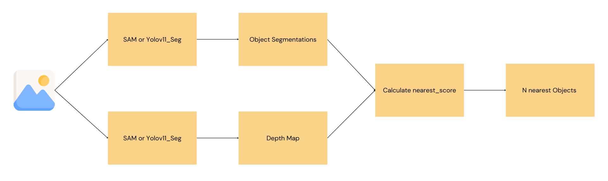
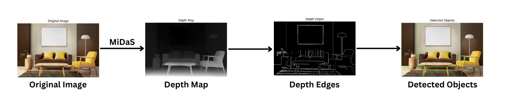

# Foreground Object Segmentation

Colab: https://colab.research.google.com/drive/1uJXPiw5LLzDIT8fMhH0lWwOWBpVnYfAI?usp=sharing

## 1. Segmentation Mask (using SAM or Yolo Seg) + Depth Map

- SAM is used to detect and segment the objects in an image and then segment mask will used to calculate the nearest_score in the depth map and then top n objects will be returned.
- nearest_score = (sum(pixel_intensities/255)/total_num_of_pixels)\*100
- This approach is working but accuracy is not good.

### Improvements

- Multiple model (like yolo11_seg + yolo11 + SAM) can be used to get the all the objects in the image and then nearest_score can be calculate.
- SAM can be trained with the specific dataset for this purpose.

## 2. Depth Map + Edge Detection

- Depth Map is used to get the edges of the nearest object.
- This approach is not accurate.
- Additional, this is hard to implement and maintain the code for the corner cases.

